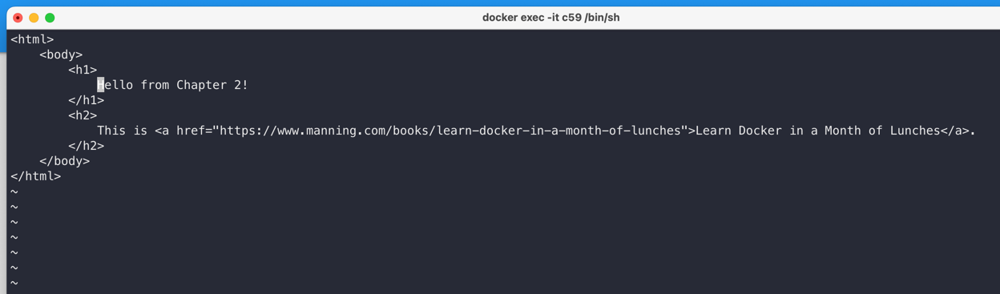

# Ch02. 기본 사용법


## 1. 예제
```shell
> docker container run diamol/ch02-hello-diamol
```
* 현재 컴퓨터에 해당 이미지가 없으므로 먼저 내려받는다(pull).
* 컨테이너로 이미지를 실행하여 hello-world가 출력된다
  * 컴퓨터 이름, 운영체제, 네트워크도 출력된다
* 핵심 워크플로: 빌드 공유 실행
* 이식성: 도커만 실행되면 어디서든 실행 가능
* 한 번 더 실행하면 pull 과정 없으며, 네트워크와 컴퓨터 이름이 바뀐다.

## 2. 컨테이너
* 각 컨테이너는 독립적으로 다음 요소를 갖는다
  * 호스트명
  * IP주소
  * 파일 시스템
* 호스트 컴퓨터의 운영체제, CPU, 메모리는 공유함
* 이러한 특성으로 인해 "밀집", "격리" 동시 달성
* 가상머신(VM): 운영체제도 별개라는 차이점
  * 리소스 소모, 라이선스, 설치 부담

## 3. Interactive
```shell
> docker container run --interactive --tty diamol/base
```
* `--interactive`: 컨테이너에 접속
* `--tty`: 터미널로 컨테이너 조작
* `hostname`, `date` 등 사용가능
* 호스트 컴퓨터의 운영체제를 공유하므로 리눅스면 리눅스, 윈도우면 윈도우 셸이 뜬다
* `docker container ls`
  * hostname이 컨테이너 id이다
* `docker container top 2244`
  * 2244는 컨테이너 id 앞글자
  * ps 비슷한 것
* `docker container logs 2244`
* `docker container inspect 2244`

## 4. 웹 호스팅
* `docker container ls`
* `docker container ls --all`
* 중요: 컨테이너 내에 애플리케이션이 실행 중이어야 컨테이너도 실행 중 상태가 된다.
  * 아니면 Exited 됨
* 컨테이너는 종료되어도 사라지지 않는다
  * 디스크 점유한다
```shell
> docker container run --detach --publish 8088:80 diamol/ch02-hello-diamol-web
```
* `--detach`: 백그라운드에서 실행, container id 출력
* `--publish`: 포트를 호스트 컴퓨터에게 공개
  * 도커 데몬이 해당 포트를 주시하며 전달해줌
* `docker container stats 2244`: 컨테이너 상태
* `docker container rm --force $(docker container ls --all --quiet)`: 모든 컨테이너 삭제

## 5. 동작 원리
* 도커 엔진: 항시 동작하는 background 프로세스
* 도커 API: REST API, 도커 엔진과 상호작용
* 도커 CLI: 도커 API의 클라이언트

## 6. 연습문제
* 웹 호스팅 컨테이너 index.html 수정하기
* 풀이
  * `docker exec -it {container_id} /bin/sh`로 인터랙티브 쉘에 접속가능
    * https://itholic.github.io/docker-enter-container/
    * 이상하게 /bin/bash는 no such file or directory 에러가 발생, /bin/sh로 바꿔서 해결
  * index.html 파일을 찾아서 바꾸었더니 웹 페이지가 바뀌었다.
     
     
